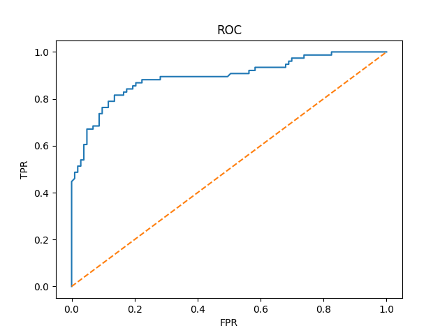

#  Titanic Survival Prediction
---

##  Project Overview


This project builds a machine learning model to predict passenger survival on the Titanic using the famous Kaggle Titanic dataset.  
The goal is to apply end-to-end machine learning workflow including data preprocessing, feature engineering, model training, evaluation, and prediction.

---

##  Project Highlights

- Real-world Kaggle dataset
- Missing-value handling
- Feature engineering
- One-hot encoding
- Feature scaling
- Logistic Regression
- Confusion matrix + ROC-AUC
- Kaggle submission pipeline
- GitHub-ready documentation

---

##  Workflow Overview

```text
Raw Data
   ↓
Missing Value Handling
   ↓
Feature Engineering
   ↓
Encoding + Scaling
   ↓
Logistic Regression
   ↓
Evaluation (Accuracy / F1 / ROC-AUC)
   ↓
Prediction on Unseen Test Data
   ↓
Kaggle Submission
```

---

##  Dataset

**Source:** Kaggle Titanic Competition

* `train.csv` → labeled dataset used for training and evaluation
* `test.csv` → unseen dataset used for Kaggle submission

Target variable:

* **Survived**

  * `1` = survived
  * `0` = did not survive

---

##  Data Preprocessing

### Missing Value Handling

The following missing values were handled using statistics learned from the training data:

* **Age** → median imputation
* **Embarked** → mode imputation
* **Fare** → median imputation

### Removed Irrelevant Features

The following columns were removed because they provided low predictive value or were redundant after feature extraction:

* Cabin
* Ticket
* PassengerId (kept separately for submission)
* Name (after title extraction)

---

##  Feature Engineering

To improve predictive performance, several new features were created:

###  Family Features

* **FamilySize** = `SibSp + Parch + 1`
* **IsAlone** = whether the passenger traveled alone

###  Fare Features

* **FarePerPerson** = `Fare / FamilySize`

###  Title Extraction

Extracted passenger titles from names:

* Mr
* Mrs
* Miss
* Rare

This helped capture social status and demographic patterns.

---

##  Encoding + Scaling

### Categorical Encoding

Applied **one-hot encoding** to:

* Sex
* Embarked
* Title

### Numerical Feature Scaling

Applied **StandardScaler** to normalize numerical features:

* Age
* Fare
* FamilySize
* FarePerPerson

> Scaling parameters were learned from the training data only and then applied consistently to validation and unseen test data.

---

##  Model

### Logistic Regression

Used **Logistic Regression** for binary classification.

Why this model?

* Strong baseline for tabular binary classification
* Interpretable coefficients
* Works well with scaled numerical features
* Excellent for demonstrating ML fundamentals

---

##  Evaluation Metrics

The model was evaluated using multiple metrics to provide a balanced performance view:

* **Accuracy**
* **Precision**
* **Recall**
* **F1-score**
* **Specificity**
* **Confusion Matrix**
* **ROC Curve**
* **AUC Score**

###  Why Multiple Metrics?

This project intentionally goes beyond accuracy to demonstrate understanding of:

* false positives
* false negatives
* threshold trade-offs
* classifier discrimination ability

---

##  ROC Curve Example

The ROC curve was generated using predicted survival probabilities:

* X-axis → False Positive Rate (FPR)
* Y-axis → True Positive Rate (TPR / Recall)
* AUC → overall ranking quality across thresholds

This demonstrates threshold-independent model evaluation.


**AUC Score:** 0.89218

---

##  Prediction on Unseen Test Data

Final predictions were generated on the unseen test data and submitted to Kaggle in the required format: PassengerId, Survived

Before making predictions, all preprocessing steps applied to the training data were consistently applied to the test data to ensure identical feature representation during inference. These steps include:

* Handling missing values (using parameters learned from the training data only)
* Feature engineering
* Removing irrelevant features
* Encoding categorical variables
* Feature scaling (using parameters learned from the training data only)

This prevents **data leakage** and guarantees consistent inference.

---

##  Tech Stack

* **Python**
* **Pandas**
* **NumPy**
* **Matplotlib**
* **scikit-learn**
* **Jupyter Notebook**

---

##  Repository Structure

```text
Titanic-ML-Project/
│
├── Titanic.ipynb
├── submission.csv
├── roc_curve.png
└── README.md
```

---

##  Skills Demonstrated

This project demonstrates practical understanding of:

* supervised learning
* binary classification
* feature engineering
* proper train/test preprocessing consistency
* prevention of data leakage
* model evaluation beyond accuracy
* Kaggle workflow and leaderboard submission
* clean notebook storytelling


---

##  Future Improvements

Planned version upgrades:

* Cross-validation
* Hyperparameter tuning
* Decision Tree / Random Forest comparison
* Full sklearn Pipeline
* Better feature interactions


